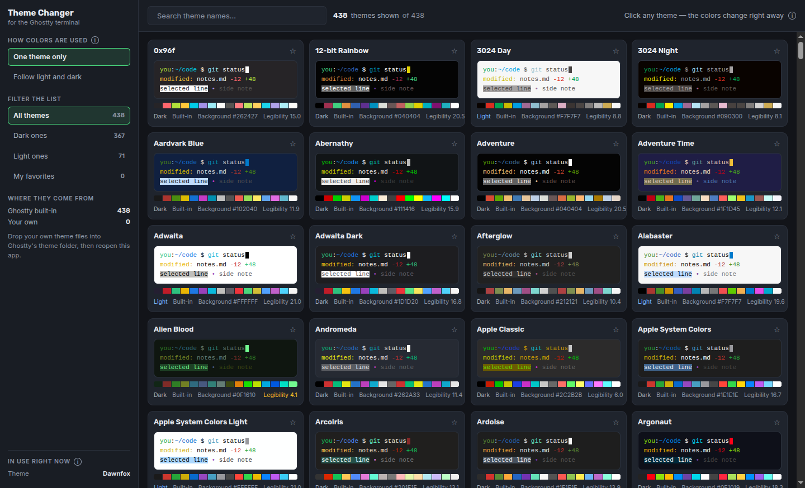

# Ghostty Theme Changer

Browse, **build**, and live-preview Ghostty themes from a small web app that runs in your normal
browser — no restart, and **no Electron**. Pick a built-in theme, tune every color to taste, or
create your own, and watch the terminal windows you already have open recolor as you go.



## Why this exists

Ghostty is a joy to use, but *changing how it looks* is a small chore. The colors live in a text
config file: you edit a `theme =` line, hope you remembered the exact name, save, and then nudge the
terminal to re-read it. Want to try five themes? That's five round-trips to a config file. Want to
tweak just the green so your `git status` pops, or nudge the background a shade darker? Now you're
hand-editing `palette = 2=#…` lines and reloading after every guess — editing colors *blind*, because
you can't see a change until after you've committed to it.

The original "theme changer without reload" solved half of this beautifully: click a card, and your
open windows recolor instantly (Ghostty re-reads its config on a `SIGUSR2` signal — no restart). But
it shipped as an **Electron** app: ~250 MB of bundled Chromium to do what is, at heart, editing one
line of text and sending a signal. And it only *picked* existing themes — it couldn't help you *make*
one.

This project keeps the good idea and drops the weight. The realizations it's built on:

- **A terminal is the perfect preview surface** — the truest preview of a terminal theme is the
  terminal itself. So instead of guessing, you *watch* it change.
- **You already have a browser**, so you don't need to bundle another one. A tiny local server does
  the file work; your normal browser is the window. The Electron tax disappears.
- **The config is just text, and colors are just data** — which means a real editor is possible:
  color-wheel pickers for the font color, background, cursor, selection, and all sixteen ANSI "code
  colors", with live contrast feedback, layered on top of any preset.
- **Live tuning has to be safe.** Dragging a color slider shouldn't shred your real config. So while
  you experiment, changes are written to a throwaway preview file that Ghostty includes optionally —
  your actual config is only touched when you decide to keep something, and every write is backed up.

The goal: make dialing in your terminal's look feel less like editing a config file and more like
play — instant, reversible, and honest about what you'll actually get.

## What it does

- **Pick a preset** — every theme on your machine (built-in + your own) shows as a card with a live
  preview in its own colors, plus its background and a contrast/legibility score.
- **Follow light & dark** — choose a light theme and a dark theme; the terminal follows the system.
- **Create & edit custom themes** — a full editor with color-wheel pickers for the font color,
  background, cursor, selection, and all 16 ANSI "code colors". Save it as a reusable theme file.
- **Override colors on any preset** — start from a theme and tweak individual colors on top of it.
- **Font family & size** — pick your terminal font (from `ghostty +list-fonts`) and size in the
  sidebar; applies live to your open windows too.
- **Live preview, two ways** — the in-app mock terminal updates instantly as you tune, and (with the
  **Live in terminal** switch on) your real open Ghostty windows recolor too, debounced.
- **Search, filter, favorites** — by name; narrow to dark/light/favorites.

## Requirements

- [Node.js](https://nodejs.org) 18+ and [Ghostty](https://ghostty.org) **1.2.0+** (live reload uses
  `SIGUSR2`, which Ghostty supports on macOS and Linux since 1.2.0).
- macOS or Linux.

## Install & run

```bash
npm install
npm run app        # builds the UI, starts the local server, opens your browser
```

After the first build you can just run `./start.sh`. For development with hot-reload:

```bash
npm run dev        # Vite (UI) + the API server, with /api proxied
```

The server binds to `127.0.0.1` only. It injects a per-launch token into the page and requires it on
every API call, so no other website open in your browser can reach it.

## How it works

The app is a tiny local **Node/Fastify** server that serves the built React UI and does the file work:
reading themes, writing your config, and signalling Ghostty. Your browser is the window — that's why
there's no bundled Chromium.

**Where it writes.** It edits the config Ghostty actually uses. On macOS that's
`~/Library/Application Support/com.mitchellh.ghostty/config` when present, otherwise the XDG
`~/.config/ghostty/config`. Custom themes go in `~/.config/ghostty/themes/`. Only the `theme` line and
(for overrides) the color keys are touched — every other setting stays put, and the previous config is
backed up (`config.cadangan-*`, five most recent kept) before each change.

**Reload without restart.** Ghostty re-reads its config on `SIGUSR2`, so after writing, the app runs
`pkill -USR2 -x ghostty`. Your windows recolor mid-session — same tabs, same running commands.

**Safe live preview.** While the *Live in terminal* switch is on, the app never rewrites your real
config on each change. It adds one optional include once —
`config-file = ?themechanger-preview.ghostty`, wrapped in sentinel comments — and then only rewrites
that throwaway preview file as you drag. Turning the switch off, or hitting **Apply to terminal**,
removes the include and (on apply) bakes your choice into the config. If the app is ever killed
mid-preview, the next launch spots the leftover include and offers **Keep changes / Discard**.

## Good to know

- The number on each card/editor is the text-vs-background contrast ratio; below 4.5 it turns amber.
- Shell-prompt colors (zsh/starship) come from your prompt, not Ghostty's palette — if a preview
  "doesn't fully change", that's usually why.
- Built with React, Vite, Chakra UI, Zustand (frontend) and Fastify (local server).
